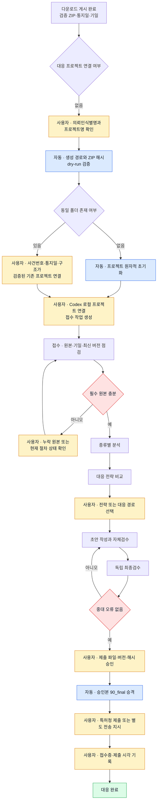

# 의견제출통지·거절결정 대응 프로젝트 진행 화면 기획

작성: 2026-09-21. 상태: **`/responses` 13단계 화면·원장·API 구현 완료, P261252 운영 투영 검증 완료**.

## 1. 목표와 화면 경계

한국특허 가출원 작성 화면의 프로젝트 선택·안전 초기화·단계 추적 방식을 중간사건 대응에도 적용한다. 대상은 다음 두 종류다.

- 의견제출통지서: `opinion_submission`
- 거절결정서: `rejection_decision`

새 전용 경로는 `/responses`로 한다. 화면 이름은 `한국특허 중간사건 대응`으로 표시한다.

- `/downloads`: Outlook 감지, EasyPAT 조회, 첨부 검증과 ZIP 게시 상태
- `/responses`: 게시된 ZIP을 사용하는 프로젝트 초기화, 접수, 분석, 전략, 초안, 검수, 승인과 제출 결과
- `/matters`: 사건 자체의 업무·기일·Action
- `/analysis`: 메일 또는 사건 연결 근거가 모호한 항목의 검토

다운로드가 `published`여도 대응 프로젝트는 시작 전일 수 있고, 프로젝트가 진행 중이어도 ZIP 게시 상태는 바꾸지 않는다. 두 상태는 한 화면에서 연결해 보여 주되 하나의 상태값으로 합치지 않는다.

우선심사 보완은 같은 데이터 구조를 재사용할 수 있지만 이번 화면의 첫 구현 범위에서는 제외한다. 실제 표본과 전용 체크리스트 검증 후 별도 종류로 추가한다.

## 2. 사용자 흐름



## 3. 화면 구성

가출원 화면과 같은 헤더·히어로·프로젝트 선택기·세로 단계 추적기를 사용하되 중간사건에 필요한 기일과 승인 정보를 추가한다.

### 상단 요약

- `사용자 작업`: 현재 장진태 님의 확인·선택·승인이 필요한 프로젝트 수
- `진행 중`: 자동 또는 작성 작업이 진행 중인 프로젝트 수
- `확인 필요`: 원본 누락, 상태 불일치, 중대 검수 오류로 보류된 수
- `대응 완료`: 접수증과 제출 결과까지 기록된 수

확정 `due_date`가 있으면 KST 기준 남은 일수를 보조 정보로 표시한다. 기일이 없거나 근거가 불충분하면 일수를 계산하지 않고 `기일 확인 필요`로 표시한다. 화면 표시용 일수는 법정기일 계산이나 확정값을 만들지 않는다.

### 프로젝트 선택기

선택 항목은 다음 형식으로 표시한다.

```text
P261252 · 1OA · 이문원바이오 · 05/13 분석
P250000 · 거절결정 1차 · 의뢰인 · 사용자 작업
```

검색·필터는 전체 당소관리번호, 통지 종류, 현재 단계, 사용자 작업 여부, 완료 여부를 지원한다. 사건번호 검색은 접미사를 포함한 전체 문자열을 보존한다.

### 초기화 패널

가출원 화면처럼 `검증만 실행(dry-run)`을 기본 동작으로 둔다. 사용자가 임의 ZIP이나 임의 루트를 입력하지 않으며 게시된 `download_package`에서만 시작한다.

- 통지 종류·차수·통지일·마감기일
- 가져올 ZIP 이름·첨부 수·SHA-256
- 고정 프로젝트 루트와 생성 예정 경로
- 의뢰인식별명과 프로젝트명
- 기존 프로젝트가 있으면 새 폴더를 만들지 않고 연결 검증으로 전환

프로젝트가 연결된 뒤에는 초기화 폼 대신 전체 경로, ZIP 해시, Codex 연결 여부와 권장 접수 작업 제목·명령을 표시한다.

### 현재 사용자 동작

단계 추적기 위에 한 문장으로 가장 먼저 해야 할 행동을 표시한다.

```text
사용자 작업: 40_strategy/2026-09-21_대응안.md의 A안 또는 B안을 선택하세요.
사용자 작업: 50_drafts/의견서_v3.hwpx SHA-256 …을 제출본으로 승인하세요.
확인 필요: 이전 제출 보정서와 접수증이 없어 거절결정 분석을 진행할 수 없습니다.
```

버튼은 `명령 복사`, `다운로드 근거 보기`, `사건 보기`, `프로젝트 상태 다시 확인`만 제공한다. Codex 작업 생성, 외부 제출과 파일 전송을 브라우저가 자동 수행하지 않는다.

## 4. 공통 13단계

가출원 화면과 같은 `현재 단계/13` 표시를 사용한다. 각 단계는 `완료`, `현재`, `대기`, `차단`, `사용자 작업 필요` 중 하나로 표현한다.

| 단계 | 이름 | 완료 근거 | 사용자 행위 |
|---:|---|---|---|
| 1 | 통지·프로젝트 정보 확인 | 사건번호, 종류, 차수, 통지일, 기일, 패키지 해시 확인 | 의뢰인식별명·프로젝트명 확인 |
| 2 | 프로젝트 초기화·연결 | 신규 생성 manifest 또는 검증된 기존 프로젝트 링크 | 기존 폴더이면 연결 선택 |
| 3 | Codex 프로젝트·접수 작업 연결 | 연결 확인 이벤트와 접수 작업 식별자 | 로컬 프로젝트 추가, `_shared` 연결, 접수 작업 생성 |
| 4 | 원본 접수·무결성 점검 | ZIP 해시, 추출 manifest, 필수 원본 점검표 | 누락 파일·최신 버전·기일 확인 |
| 5 | 종류별 쟁점 분석 | `30_analysis` 분석 산출물과 해시 | 분석 질문에 필요한 사실 확인 |
| 6 | 대응 전략 비교 | `40_strategy` 선택지·위험 비교표와 해시 | 없음 |
| 7 | 전략·대응 경로 선택 | 선택 대상 파일·선택안·시각이 기록된 승인 이벤트 | 전략 또는 대응 경로 명시 선택 |
| 8 | 승인 범위의 초안 작성 | `50_drafts` 초안과 버전·해시 | 승인 범위를 벗어난 변경이 있으면 재확인 |
| 9 | 작성자 자체검수 | 자체검수 결과와 수정 이력 | 없음 |
| 10 | 독립 최종검수 | `60_review` 검수 결과, 검수 입력·출력 해시 | 중대 오류가 있으면 수정 방향 확인 |
| 11 | 제출본 승인 | 특정 상대경로·버전·SHA-256 승인 이벤트 | 제출할 파일을 명시적으로 승인 |
| 12 | 최종본 승격·외부 제출 | 승인 해시와 같은 `90_final` 파일, 외부 제출 지시·결과 | 특허청 제출 또는 별도 전송 지시 |
| 13 | 접수증·결과 기록 | 접수증, 실제 제출 시각, 제출 파일 해시 | 결과를 확인하고 기록 완료 |

파일이 존재한다는 이유만으로 7단계 전략 선택, 11단계 제출본 승인, 12단계 외부 제출을 완료 처리하지 않는다. 세 단계는 명시적인 사용자 이벤트가 있어야 한다.

## 5. 종류별 단계 문구와 산출물

단계 번호는 공통으로 유지하고 4~8단계의 설명·필수 산출물만 통지 종류에 따라 바꾼다.

### 의견제출통지서

| 단계 | 표시 문구 | 필수 산출물 |
|---:|---|---|
| 4 | 통지서·최신 청구항·명세서·인용문헌 접수 | 원본 점검표, 기일 근거 |
| 5 | 거절이유별 청구항·구성요소·근거 분석 | 진보성/기재불비/기타 거절이유표 |
| 6 | 보정·주장 전략과 권리범위 위험 비교 | 대응전략 A/B안, 원출원 근거표 |
| 7 | 적용 전략·보정 문언 선택 | 선택안과 승인 범위 이벤트 |
| 8 | 의견서·보정서 초안 작성 | 의견서, 보정서, 변경 대응표 |

### 거절결정서

| 단계 | 표시 문구 | 필수 산출물 |
|---:|---|---|
| 4 | 거절결정서·이전 OA·제출 의견서·보정서·접수증 접수 | 선행 절차 점검표, 현재 기일 근거 |
| 5 | 이전 거절이유와 결정 판단 비교 | 유지·변경·신규 판단 비교표 |
| 6 | 실제 가능한 대응 경로·위험 비교 | 대응 경로별 목표·절차·기일 위험표 |
| 7 | 대응 경로·목표 범위 선택 | 선택 경로와 승인 범위 이벤트 |
| 8 | 선택 경로의 문서 초안 작성 | 선택 경로별 초안과 이전 제출 대조표 |

거절결정 화면은 절차 종류나 법정기일을 추정하지 않는다. 원문, EasyPAT 또는 사용자 확인 근거가 없으면 4단계를 `차단`으로 유지한다.

## 6. 산출물 패널

가출원 화면의 산출물 확인 영역을 다음 카드로 바꾼다.

- 자동 다운로드 ZIP과 추출 manifest
- 원본 접수 점검표
- 종류별 분석표
- 대응전략 비교표
- 사용자 전략 선택 기록
- 최신 초안과 자체검수
- 독립 최종검수
- 제출본 승인 기록
- `90_final` 승인본
- 접수증과 제출 결과

각 카드는 `없음`, `작성 중`, `검증됨`, `사용자 승인`, `불일치`를 표시하고 상대경로·버전·SHA-256 앞 12자를 보여 준다. 원본 전체 경로, EasyPAT 내부키, 쿠키와 개인정보는 API 응답에 노출하지 않는다.

## 7. 상태 원본과 동기화

진행 상태의 운영 원본은 SQLite의 `notice_project_stage`와 추가 이력 테이블이다. 프로젝트 내부 `case.yaml`과 `STATUS.md`는 사람이 읽는 작업 원본으로 유지한다.

- DB와 두 파일의 단계가 같고 기준 산출물 해시가 일치할 때만 정상으로 표시
- 값이 다르면 더 높은 단계를 채택하지 않고 `상태 불일치 · 확인 필요`로 표시
- 브라우저 조회는 파일이나 DB를 자동 수정하지 않음
- 상태 다시 확인은 고정 프로젝트 루트 내부의 허용 파일만 읽고 결과 이벤트를 남김
- 기존 이벤트를 덮어쓰지 않고 정정·승인·반려를 새 이벤트로 추가

현재 `notice_project_stage`는 현재 단계 한 건만 저장하므로 새 마이그레이션에서 다음을 추가한다. 이미 운영 적용된 `010`은 수정하지 않는다.

| 테이블 | 목적 |
|---|---|
| `notice_project_artifact` | 단계별 상대경로, 종류, 버전, SHA-256, 검증 상태 |
| `notice_project_approval` | 전략 선택, 초안 범위, 제출본, 외부 제출 지시의 대상·결정·시각 |
| `notice_project_task_link` | 권장 Codex 작업 제목과 사용자가 연결한 실제 작업 ID |

`notice_project_event`는 초기화·단계 이동·상태 재검사·정정의 불변 이력으로 계속 사용한다.

## 8. 단계 변경 규칙

1. 단계 완료 API는 현재 `row_version`, 단계 키, 기준 산출물 상대경로와 SHA-256을 요구한다.
2. 요청 당시 단계와 행 버전이 달라지면 `409`로 거절하고 화면을 새로 읽는다.
3. 다음 단계의 필수 산출물과 사용자 승인이 없으면 건너뛰지 않는다.
4. 독립 검수에 중대 오류가 있으면 10단계를 `차단`으로 유지하고 8단계 수정으로 되돌리는 이벤트를 남긴다.
5. 승인 뒤 대상 파일 해시가 달라지면 승인을 자동 무효화하고 11단계를 다시 `사용자 작업 필요`로 표시한다.
6. 제출 결과와 접수증이 없으면 13단계와 프로젝트 `completed`를 표시하지 않는다.
7. 다운로드 패키지가 새 버전으로 교체되면 기존 프로젝트를 삭제하지 않고 원본 변경 경고와 재접수 필요 여부를 표시한다.

## 9. API와 코드 구성

기존 프로젝트 preview·create·기존 연결 API는 재사용하고 진행 조회·변경 API를 `/api/responses` 아래에 둔다.

- `GET /api/responses/summary`
- `GET /api/responses/projects?q=&kind=&stage=&userAction=`
- `GET /api/responses/projects/:id`
- `POST /api/responses/projects/:id/reconcile`: 허용된 프로젝트 상태 파일·산출물 재확인
- `POST /api/responses/projects/:id/stages/:stage/complete`
- `POST /api/responses/projects/:id/approvals`
- `POST /api/responses/projects/:id/task-links`

추천 코드 분리는 다음과 같다.

- `dashboard/app/responses/page.tsx`: 전용 화면
- `dashboard/app/response-workflow.ts`: 공통 13단계와 종류별 표시 정의
- `dashboard/lib/notice-response-projects.ts`: 읽기 투영, 단계·승인·동기화 규칙
- `dashboard/db/migrations/011_notice_response_progress.sql`: 산출물·승인·작업 링크 원장

## 10. 단계별 구현 순서

1. **읽기 투영:** 현재 `notice_project_link`·`notice_project_stage`와 P261252 프로젝트를 읽어 13단계로 투영한다.
2. **읽기 전용 화면:** 프로젝트 선택기, 상단 집계, 현재 사용자 동작, 단계 추적기와 산출물 패널을 구현한다.
3. **초기화 연결:** `/downloads`의 프로젝트 생성·기존 연결 결과가 `/responses` 목록에 즉시 나타나도록 한다.
4. **상태 재확인:** 고정 루트 내부의 `case.yaml`, `STATUS.md`와 허용 산출물을 읽어 불일치만 보고한다.
5. **단계·산출물 이력:** `011` 마이그레이션과 낙관적 잠금 기반 단계 완료 API를 추가한다.
6. **사용자 승인:** 전략 선택과 제출본 승인 대상을 경로·버전·해시로 기록하고 파일 변경 시 무효화한다.
7. **OA 검증:** P261252를 읽기 전용으로 연결해 초기화부터 현재 단계까지 표시가 맞는지 검증한다.
8. **거절결정 검증:** 실제 표본 한 건으로 선행 절차 자료, 분석 문구, 대응 경로와 승인 게이트를 검증한 뒤 프로젝트 생성을 활성화한다.
9. **홈 연결:** 업무 홈에 `한국특허 중간사건 대응` 카드를 추가하고 `/downloads`의 연결 프로젝트에 `대응 화면 열기`를 제공한다.

## 11. 검수 기준

- P261252가 의견제출통지서 1차 프로젝트 하나로 표시되고 다운로드 ZIP·프로젝트·단계가 중복되지 않는다.
- 같은 사건의 1OA·2OA와 거절결정 1차·2차가 각각 별도 프로젝트 진행으로 표시된다.
- 전체 당소관리번호와 접미사가 경로·DB·화면·검색에서 보존된다.
- 게시 완료 전에는 프로젝트 초기화를 실행할 수 없다.
- 파일 존재만으로 전략 선택, 제출본 승인, 외부 제출과 대응 완료가 표시되지 않는다.
- 기일 근거가 없으면 남은 일수나 법정기일을 추정하지 않는다.
- 승인 대상 파일이 바뀌면 승인이 무효화되고 사용자 작업으로 돌아간다.
- DB, `case.yaml`, `STATUS.md` 불일치는 자동 병합되지 않고 확인 필요로 표시된다.
- 기존 폴더와 파일은 덮어쓰거나 삭제하지 않는다.
- 화면 새로고침은 Outlook, EasyPAT, 외부 제출과 파일 변경을 발생시키지 않는다.
- `/responses`, 새 API, 기존 필수 화면·API, lint, phase1~4와 build가 모두 성공한다.

## 12. 첫 화면에서 사용자가 보게 될 핵심 정보

```text
P261252 · 의견제출통지서 · 1OA
통지일 2026-06-25 · 마감기일 2026-10-25
현재 02/13 프로젝트 초기화·연결

사용자 작업
의뢰인식별명과 P261252_이문원바이오_1OA 프로젝트명을 확인한 뒤
경로·원본 검증을 실행하세요.

다운로드 근거
[P261252] 1OA (2026-06-25)(2026-10-25).zip
첨부 3/3 검증 · SHA-256 9d8f7bc15262…
```

프로젝트가 생성되면 같은 화면이 3단계 `Codex 프로젝트·접수 작업 연결`로 이동하고, 복사 가능한 접수 작업 제목과 명령을 보여 준다. 이후에는 현재 단계의 산출물과 사용자 동작만 강조하며 완료 단계는 접어서 볼 수 있게 한다.

## 13. 2026-09-21 구현 결과

- 업무 홈에 `한국특허 중간사건 대응` 카드를 추가하고 `/responses` 전용 화면을 구현했다.
- 게시 완료된 의견제출통지서와 거절결정서를 프로젝트 미생성 상태부터 조회하며, P261252는 `01/13 통지·프로젝트 정보 확인`과 사용자 작업으로 운영 화면에 표시된다.
- 프로젝트 선택기, 종류·사용자 작업 필터, 통지일·마감기일·ZIP 해시, 현재 사용자 동작, 공통 13단계, 산출물·승인·이력 패널을 구현했다.
- 기존 `/downloads`의 안전한 preview·create·기존 프로젝트 연결 API를 재사용하고, 연결된 프로젝트에서 `/responses`로 이동할 수 있게 했다.
- `011_notice_response_progress.sql`에 단계 번호와 상태 재확인 정보, 단계별 산출물, 사용자 승인, Codex 작업 연결 원장을 추가했다. 운영 적용 전 DB 백업을 생성하고 기존 `010` 데이터와 외래키를 보존했다.
- 접수 작업 연결, 산출물 해시 검증, 단계 전환, 전략 선택, 제출본 승인, `90_final` 무덮어쓰기 승격, 외부 제출 결과, 접수증 기록 API를 구현했다.
- 승인 파일이 변경되거나 없어지면 이전 승인을 삭제하지 않고 `revoked` 이력을 추가하며 해당 사용자 단계로 되돌려 `확인 필요`로 표시한다.
- DB, `case.yaml`, `STATUS.md` 단계 불일치를 자동 병합하지 않고 상태 재확인 결과와 이벤트로 기록한다.
- 전용 회귀에서 3단계부터 13단계 완료까지 전환하고, 승인 파일 변경 뒤 12단계로 복귀하는 것을 검증했다.

거절결정서의 종류별 문구와 데이터 경로는 구현됐지만 새 프로젝트 자동 생성 기능 플래그는 실제 거절결정 표본 검증 전까지 기존 설정대로 비활성이다. 검증된 기존 거절결정 프로젝트는 연결해 진행 상태를 표시할 수 있다.
