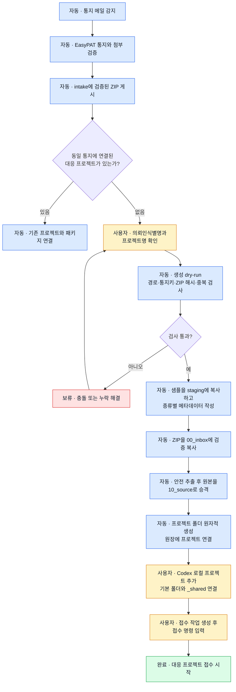
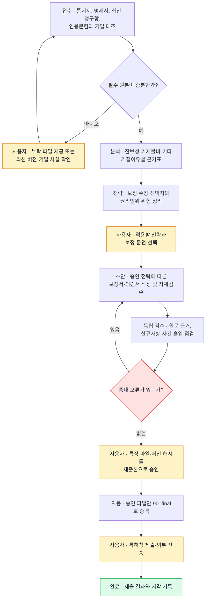
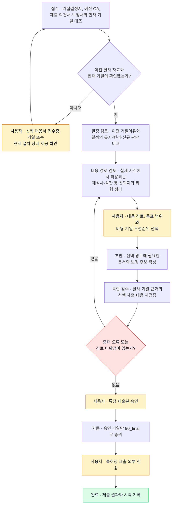
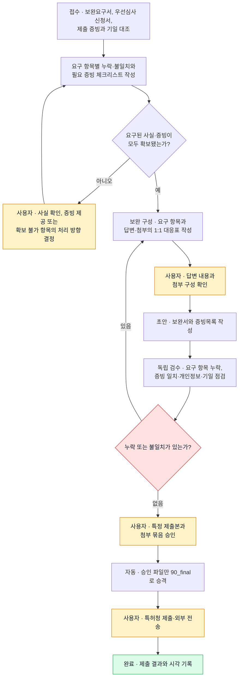

# 통지 종류별 대응 프로젝트 생성·진행 기획

작성: 2026-09-21. 상태: **공통 원장·대시보드 단계 표시·OA 프로젝트 안전 초기화 구현 완료, 거절결정·우선심사 보완 표본 검증 대기**.

이 문서는 의견제출통지서, 거절결정서, 우선심사신청보완요구서의 다운로드가 끝난 뒤 실제 대응 프로젝트를 만드는 절차를 정의한다. 자동 다운로드 완료와 법률 업무 완료는 서로 다른 상태로 관리한다.

## 1. 고정 경로와 이름 규칙

기존 중간사건 대응 구조를 그대로 사용한다.

```text
프로젝트 루트
C:\ChatGPT\AI-Work\10_특허\한국특허중간사건대응\

복사 원본
C:\ChatGPT\AI-Work\10_특허\한국특허중간사건대응\_sample_case_project\

공유 자료
C:\ChatGPT\AI-Work\10_특허\한국특허중간사건대응\_shared\

자동 다운로드 게시 폴더
C:\Users\donsh\OneDrive\Desktop\ONEDRIVE\Desktop\[상상] 업무분류\0-0. intake\
```

프로젝트 폴더명은 전체 당소관리번호를 보존하고 통지 종류·차수를 붙인다.

| 종류 | 프로젝트 폴더명 | 예시 |
|---|---|---|
| 의견제출통지서 | `{사건번호}_{의뢰인식별명}_{n}OA` | `P261252_이문원바이오_1OA` |
| 거절결정서 | `{사건번호}_{의뢰인식별명}_거절결정_{n}차` | `P261487_홈런코퍼레이션_거절결정_1차` |
| 우선심사 보완 | `{사건번호}_{의뢰인식별명}_우선심사보완_{n}차` | `P261643_효성프라콘_우선심사보완_1차` |

`P241750-RE`, `P262000-S1`처럼 접미사가 있는 사건번호는 줄이지 않는다. 의뢰인식별명은 폴더에 사용할 수 없는 문자와 불필요한 공백만 정규화한다. 같은 이름의 폴더가 있으면 덮어쓰지 않고 기존 프로젝트 연결 여부를 사용자에게 확인한다.

## 2. 사용자 행위 표시 규칙

순서도에서 색과 접두사를 다음처럼 사용한다.

- 파란색 `자동`: 자동 다운로드 작업자·프로젝트 초기화기가 수행
- 노란색 `사용자`: 장진태 님이 사실 확인, 프로젝트 연결, 전략 선택 또는 승인을 수행
- 빨간색 `보류`: 자료·근거·승인이 없어 다음 단계로 갈 수 없음
- 초록색 `완료`: 검증된 단계 산출물과 상태 기록이 함께 존재

## 3. 프로젝트 생성 공통 순서도



대시보드의 `프로젝트 생성`은 ZIP 게시 완료 뒤에만 활성화한다. 자동화는 intake의 ZIP을 이동하거나 삭제하지 않는다. ZIP을 프로젝트의 `00_inbox`에 복사한 뒤 원장 SHA-256과 다시 대조하고, 경로 이탈·중복 항목·크기 제한을 검사한 추출본만 `10_source`에 둔다.

## 4. 생성되는 폴더와 파일

초기화기는 `_sample_case_project` 전체를 복사한 뒤 다음 구조를 만든다.

```text
{프로젝트폴더}\
├─ AGENTS.md
├─ case.yaml
├─ STATUS.md
├─ README_복사방법.md
├─ README_실제사건_프로젝트_실행방법.md
├─ 00_inbox\
│  └─ {자동 다운로드 ZIP 원본}
├─ 10_source\
│  ├─ download-manifest.json
│  └─ {통지서·인용문헌·특허청 원본·연결 첨부}
├─ 20_extracted\
├─ 30_analysis\
│  ├─ inventive-step\             # OA에서 필요할 때 사용
│  ├─ description-defect\         # OA에서 필요할 때 사용
│  ├─ rejection-decision\         # 거절결정 프로젝트에서 생성
│  └─ priority-supplement\        # 우선심사 보완 프로젝트에서 생성
├─ 40_strategy\
├─ 50_drafts\
├─ 60_review\
├─ 90_final\
└─ 99_logs\
   └─ YYYY-MM-DD_프로젝트초기화.md
```

`10_source`의 원본은 이후 수정하지 않는다. 자동 다운로드 ZIP에 없는 최신 명세서·청구항·선행 대응서·우선심사 신청자료는 접수 작업에서 누락으로 기록하고, 사용자가 제공하거나 검증된 별도 원본 조회가 끝난 뒤 `10_source`에 추가한다.

`case.yaml`은 기존 필드에 다음 통지 연결 정보를 추가하는 방향으로 확장한다.

```yaml
notice:
  kind: opinion_submission # rejection_decision / priority_exam_supplement_request
  sequence: 1
  notice_date: YYYY-MM-DD
  response_deadline: YYYY-MM-DD
  progress_sequence: null
  source_package: 00_inbox/[사건번호] ... .zip
  source_package_sha256: null
  source_notice_id: null
workflow:
  current_stage: intake
  user_action_required: false
  user_action_code: null
  action_summary: null
```

`STATUS.md`에는 같은 현재 단계, 기준 자료, 미확인 사항과 사용자 승인 범위를 사람이 읽을 수 있는 형태로 함께 기록한다. 두 파일이 다르면 다음 단계로 진행하지 않는다.

## 5. Codex 프로젝트와 작업 구성

사건별 프로젝트는 다음처럼 설정한다.

- 기본 폴더: 생성된 해당 사건 프로젝트 폴더
- 보조 폴더: `C:\ChatGPT\AI-Work\10_특허\한국특허중간사건대응\_shared`
- 연결 금지: `_eval`, 다른 실제 사건 프로젝트

Codex에 해당 로컬 프로젝트가 없으면 사용자가 한 번 추가해야 한다. 대시보드나 다운로드 작업자는 Codex 프로젝트를 임의로 등록하지 않는다. 프로젝트 등록 뒤에는 다음 작업을 순서대로 만든다.

| 순서 | 권장 작업 제목 | 목적 | 시작 조건 |
|---|---|---|---|
| 1 | `[CASE] {사건번호} - 접수` | 원본·기일·최신 버전·누락 점검 | 프로젝트 생성 완료 |
| 2 | 종류별 분석 작업 | 거절이유·결정·보완요구 분석 | 접수 완료 |
| 3 | `[CASE] {사건번호} - 대응전략` | 선택지·위험·추천안 작성 | 분석 완료 |
| 4 | `[CASE] {사건번호} - 초안` | 승인된 전략의 문서 초안 | 사용자 전략 선택 완료 |
| 5 | `[CASE] {사건번호} - 최종검수` | 별도 작업에서 독립 검수 | 초안·자체검수 완료 |

각 작업은 `case.yaml`, `STATUS.md`, 사용한 원본 버전과 직전 산출물을 다시 읽고 시작한다. 새 작업의 메시지에는 사건번호, 통지 종류·차수, 목표 산출물, 기준 파일 버전을 적는다.

### 공통 접수 명령

```text
{사건번호} {통지종류} {차수} 접수를 진행해줘. AGENTS.md, case.yaml,
STATUS.md와 공유 폴더의 사람승인·비밀유지 정책 및 사건접수 체크리스트를 먼저 읽어라.
00_inbox의 자동 다운로드 ZIP 해시와 10_source 승격 결과를 대조하고, 원본을 수정하지
마라. 통지일·마감기일·진행번호·최신 청구항 또는 신청자료·선행 대응서와 첨부 누락을
확인해 20_extracted에 접수점검을 작성하라. 추측하지 말고 미확인 사항은 STATUS.md에
사용자 질문으로 남겨라. case.yaml과 STATUS.md를 같은 작업에서 갱신하고 외부 제출이나
전송은 하지 마라.
```

### 공통 최종검수 명령

```text
{사건번호} {통지종류} {차수}의 독립 최종검수를 진행해줘. 작성 작업의 결론을 전제로
삼지 말고 10_source 원문, 승인된 40_strategy, 50_drafts의 대상 파일과 해시를 다시
대조하라. 사건 혼입, 기일·청구항·문헌·증빙 오류, 근거 누락과 제출 위험을 중대도별로
60_review에 기록하라. 검수 통과를 제출 승인으로 표시하거나 파일을 외부 전송하지 마라.
```

## 6. 의견제출통지서 프로젝트

### 처리 순서도



### 종류별 작업과 명령

분석 작업 제목은 실제 거절이유에 따라 `[CASE] {사건번호} - 진보성`, `[CASE] {사건번호} - 기재불비` 또는 둘 다 만든다.

```text
접수 결과를 기준으로 {사건번호} {n}OA의 실제 거절이유만 분석해줘. 진보성은 청구항별
구성요소와 인용문헌의 근거 위치를, 기재불비는 심사관 지적·원문·보정 후보의 대응을
30_analysis의 해당 하위 폴더에 작성하라. 사용자 보정안이 있으면 먼저 보정 전 원문에
매칭하라. 대응 문언이나 최종 법적 결론은 확정하지 마라.
```

```text
{사건번호} {n}OA 분석을 바탕으로 대응전략 A/B안을 40_strategy에 작성해줘. 각 안의
보정 문언, 원출원 근거, 거절 해소 논리, 권리범위·신규사항·금반언 위험과 필요한 추가
사실을 비교하라. 추천안은 제시하되 초안 작성 전에 내 선택을 기다려라.
```

사용자가 전략을 선택한 뒤 초안 작업에 다음처럼 지시한다.

```text
{사건번호} {n}OA에 대해 내가 승인한 전략 {전략명/승인 문언}만 반영하여 의견서와
보정서 초안을 50_drafts에 작성해줘. 공식 단락번호와 변경 추적 기준을 적용하고 자체검수
기록을 60_review에 남겨라. 제출본 승인이나 외부 전송으로 간주하지 마라.
```

## 7. 거절결정서 프로젝트

### 처리 순서도



분석 작업 제목은 `[CASE] {사건번호} - 거절결정 검토`로 한다.

```text
{사건번호} 거절결정 {n}차를 검토해줘. 거절결정서의 판단을 이전 의견제출통지서,
제출 의견서·보정서, 최신 청구항과 항목별로 대조하고 유지된 이유, 새로 등장한 판단,
받아들여진 주장과 미해결 쟁점을 30_analysis/rejection-decision에 작성하라. 현재 가능한
대응 경로와 법정기일은 원문·EasyPAT·사용자 확인 근거가 있을 때만 표시하고 임의 계산하지
마라. 최종 경로는 선택하지 마라.
```

```text
거절결정 검토 결과를 기준으로 실제 사건에서 허용되는 대응 경로별 목표, 필요한 보정,
주요 주장, 절차·기일 위험과 추가 자료를 40_strategy에 비교해줘. 추천 이유를 적되 내가
대응 경로를 선택할 때까지 초안을 만들지 마라.
```

사용자가 대응 경로를 선택한 뒤 초안 작업에 다음처럼 지시한다.

```text
{사건번호} 거절결정 {n}차에 대해 내가 승인한 대응 경로 {대응경로/승인 범위}에 필요한
문서 초안을 50_drafts에 작성해줘. 이전 제출 문언, 최신 청구항, 결정 이유와 원출원 근거를
대조하고 자체검수 기록을 남겨라. 허용 절차나 기일을 추정하지 말고 제출본 승인·외부
전송으로 간주하지 마라.
```

거절결정용 전용 체크리스트와 작성 라우팅은 현재 공용 OA 템플릿에 없다. 자동 초안 단계를 활성화하기 전에 `_shared`에 거절결정 접수·전략·검수 지침을 추가하고 실제 표본으로 검증한다. 그 전에는 분석 결과와 사용자 선택을 근거로 사건별 명시 지시를 사용한다.

## 8. 우선심사 보완 프로젝트

### 처리 순서도



분석 작업 제목은 `[CASE] {사건번호} - 우선심사 보완자료 점검`으로 한다.

```text
{사건번호} 우선심사 보완 {n}차의 요구사항을 항목별로 분해해줘. 보완요구서, 기존
우선심사 신청서와 제출 증빙을 대조하고 요구 항목·현재 자료·누락·필요 확인·예정 첨부를
30_analysis/priority-supplement의 체크리스트로 작성하라. 기일이나 사실을 추정하지 말고
사용자 확인이 필요한 항목을 STATUS.md와 case.yaml에 표시하라.
```

```text
사용자가 확인한 사실과 제공 증빙을 기준으로 요구 항목별 답변·첨부 1:1 대응표와 보완
구성안을 40_strategy에 작성해줘. 증빙이 없는 항목을 충족으로 표시하지 말고, 답변 내용과
첨부 구성을 내가 확인할 때까지 제출용 초안을 만들지 마라.
```

```text
승인된 우선심사 보완 구성 {승인안}에 따라 보완서 초안과 증빙목록을 50_drafts에 작성해줘.
요구 항목 번호, 답변, 첨부 파일명을 1:1로 연결하고 자체검수 기록을 남겨라. 원본 증빙을
수정하거나 제출본 승인·외부 전송으로 간주하지 마라.
```

우선심사 보완용 전용 접수·작성 체크리스트와 문서 템플릿은 현재 공용 OA 템플릿에 없다. 실제 P261643 관련 탭·첨부 구조와 문서 표본을 검증한 뒤 전용 라우팅을 추가하기 전에는 자동 초안을 활성화하지 않는다.

## 9. 사용자가 해야 할 동작 요약

| 시점 | 사용자 동작 | 세 종류 공통 여부 |
|---|---|---|
| 프로젝트 생성 전 | 대시보드에서 의뢰인식별명·프로젝트명·통지 종류·차수 확인 | 공통 |
| 폴더 생성 후 | Codex에 사건 폴더를 로컬 프로젝트로 추가하고 `_shared`를 보조 폴더로 연결 | 공통 |
| 작업 시작 | 권장 제목으로 접수 작업을 만들고 공통 접수 명령 입력 | 공통 |
| 접수 보류 | 누락 원본, 최신 버전, 기일과 현재 절차 상태를 제공·확인 | 공통 |
| 분석 후 | 대응 전략 또는 경로를 명시적으로 선택 | 공통, 선택 내용은 종류별 상이 |
| 초안 전 | 적용할 보정 문언, 주장 범위 또는 보완 답변·첨부 구성을 승인 | 공통 |
| 최종검수 후 | 제출할 특정 파일의 경로·버전·해시를 승인 | 공통 |
| 제출 | 특허청 제출이나 외부 전송을 직접 수행하거나 별도 명시 지시 | 공통 |
| 제출 후 | 접수증·제출 시각·최종 파일을 프로젝트에 기록 | 공통 |

사용자 승인 문구는 다음 수준으로 구체적으로 남긴다.

```text
40_strategy/{파일명}의 {전략명}을 선택한다. 이 승인은 초안 작성 범위이며 제출 승인은 아니다.
```

```text
50_drafts/{파일명} 버전 {버전}, SHA-256 {해시}를 제출본으로 승인한다.
90_final 승격을 허용한다. 외부 제출은 별도 지시한다.
```

## 10. 대시보드 표시와 프로젝트 연결

`/downloads`의 게시 완료 행에는 `대응 프로젝트` 영역을 추가한다.

프로젝트 초기화 뒤 접수·분석·전략·초안·검수·승인·제출 진행은 가출원 화면과 분리된 `/responses`에서 13단계로 표시한다. 화면 구성, 상태 원본, 사용자 승인과 단계 변경 규칙은 [의견제출통지·거절결정 대응 프로젝트 진행 화면 기획](./NOTICE_RESPONSE_PROGRESS_DASHBOARD_PLAN.md)을 따른다.

- 미생성: `프로젝트 생성 준비`와 사용자 확인 항목 표시
- 생성 점검: 예상 폴더, 복사할 ZIP, 통지 종류·차수와 dry-run 결과 표시
- 폴더 생성 완료: 전체 경로와 `Codex 프로젝트 연결 필요` 표시
- 접수 작업 필요: 권장 작업 제목과 복사 가능한 접수 명령 표시
- 진행 중: `case.yaml`의 현재 단계, 최신 산출물과 사용자 행위 코드 표시
- 사용자 대기: 필요한 행동을 한 문장으로 표시하고 관련 파일·`/analysis` 링크 제공
- 대응 완료: 승인된 `90_final` 파일과 제출 결과 기록 표시

다운로드 상태 `published`와 대응 프로젝트 상태 `completed`는 별도 필드로 유지한다. ZIP 게시만으로 의견서·보정서·불복서류·우선심사 보완 제출이 완료됐다고 표시하지 않는다.

추가 데이터는 다음처럼 둔다.

- `notice_project_link`: 통지, 프로젝트 이름·고정 루트 상대경로, 생성 상태, 생성 manifest 해시, 연결 시각
- `notice_project_stage`: 프로젝트, 단계, 상태, 사용자 행위 코드·요약, 기준 산출물 경로·해시, 갱신 시각
- `notice_project_event`: 생성, 자료 추가, 전략 선택, 초안·검수·승인·제출 기록의 불변 이력

사용자 행위 코드는 다음 값으로 고정하고 화면에는 오른쪽 설명을 표시한다.

| 코드 | 화면의 다음 동작 |
|---|---|
| `confirm_project_identity` | 의뢰인식별명, 프로젝트명, 통지 종류와 차수를 확인하세요. |
| `connect_codex_project` | 생성된 폴더를 Codex 로컬 프로젝트로 추가하고 `_shared`를 연결하세요. |
| `create_intake_task` | 표시된 제목으로 접수 작업을 만들고 접수 명령을 입력하세요. |
| `provide_missing_sources` | 표시된 누락 원본 또는 최신 버전을 제공하세요. |
| `confirm_deadline_or_procedure` | 현재 기일과 절차 상태를 원문 또는 EasyPAT 근거로 확인하세요. |
| `select_strategy` | `40_strategy`의 대응안 또는 대응 경로를 선택하세요. |
| `approve_draft_scope` | 초안에 반영할 문언·주장 또는 보완 답변·첨부 구성을 승인하세요. |
| `approve_submission_copy` | 제출할 파일의 경로·버전·해시를 승인하세요. |
| `external_dispatch_required` | 승인된 제출본을 특허청에 제출하거나 별도 전송 지시를 하세요. |
| `record_filing_receipt` | 접수증, 제출 시각과 실제 제출 파일을 기록하세요. |

프로젝트 생성 API는 `preview`와 `create`를 분리한다. `create`는 preview 토큰의 통지키·패키지 해시·목적지 부재가 그대로일 때만 실행하고, staging 완성 후 같은 루트 안에서 원자적으로 이름을 확정한다. 임의 루트, 절대 목적지, 기존 폴더 덮어쓰기와 심볼릭 링크는 허용하지 않는다.

## 11. 구현 순서와 검수 기준

1. 통지 종류를 포함하는 `case.yaml` 확장안과 종류별 폴더명 정규화기를 구현한다.
2. 샘플 복사·ZIP 검증 복사·안전 추출·원자적 프로젝트 생성을 dry-run부터 구현한다.
3. `/downloads`에 프로젝트 생성 미리보기, 사용자 행위 표시와 프로젝트 링크를 추가한다.
4. OA의 기존 P261252 ZIP으로 새 임시 프로젝트 생성·재실행 무변경·원본 해시 보존을 검증한다.
5. 거절결정 전용 접수·전략·검수 지침과 표본을 검증한다.
6. 우선심사 보완 전용 접수·작성 체크리스트와 P261643 표본을 검증한다.
7. 종류별 프로젝트 상태가 다운로드 상태와 독립적으로 표시되는지 검증한다.

필수 회귀는 다음과 같다.

- 같은 통지의 두 메일과 ZIP 하나가 프로젝트 하나에만 연결된다.
- 동일 프로젝트 폴더가 있으면 생성하지 않고 사용자 확인으로 전환한다.
- intake ZIP은 이동·삭제되지 않고 프로젝트 복사본과 SHA-256이 일치한다.
- ZIP의 경로 이탈, 동명 항목, 손상과 원장 해시 불일치는 프로젝트 생성을 차단한다.
- `AGENTS.md`, `case.yaml`, `STATUS.md`, 단계별 폴더와 안내문이 모두 복사된다.
- 다른 실제 사건, `_eval`, 공용 원본이 프로젝트 폴더 안으로 복사되지 않는다.
- 사용자 행위가 필요한 단계는 대시보드에서 사유와 정확한 다음 동작을 표시한다.
- 사용자 전략 선택 없이 초안 단계, 특정 파일 승인 없이 `90_final`, 외부 제출 지시 없이 전송 단계로 진행하지 않는다.

## 12. 구현 경계

현재 `/downloads`에서 게시 완료 OA의 프로젝트 경로를 dry-run으로 검증한 뒤 프로젝트를 생성할 수 있다. 생성 결과에는 원본 ZIP, 검증 추출본, `case.yaml`, `STATUS.md`, 생성 manifest와 초기화 이력이 포함되고 다음 사용자 동작은 `connect_codex_project`로 표시된다. 같은 이름의 프로젝트 폴더가 이미 있으면 덮어쓰지 않고 `case.yaml`의 전체 사건번호와 선택 입력, 필수 폴더 구조를 검증해 기존 프로젝트로 연결할 수 있다. 거절결정과 우선심사 보완도 동일 데이터 모델과 폴더 분기를 갖지만, 실제 표본·전용 체크리스트 검증 전이라 설정에서 생성 버튼을 비활성화했다.

프로젝트 생성은 Codex 작업을 대신 만들지 않으며 최종 제출과 외부 전송은 사용자의 명시적 지시에 따른다.
